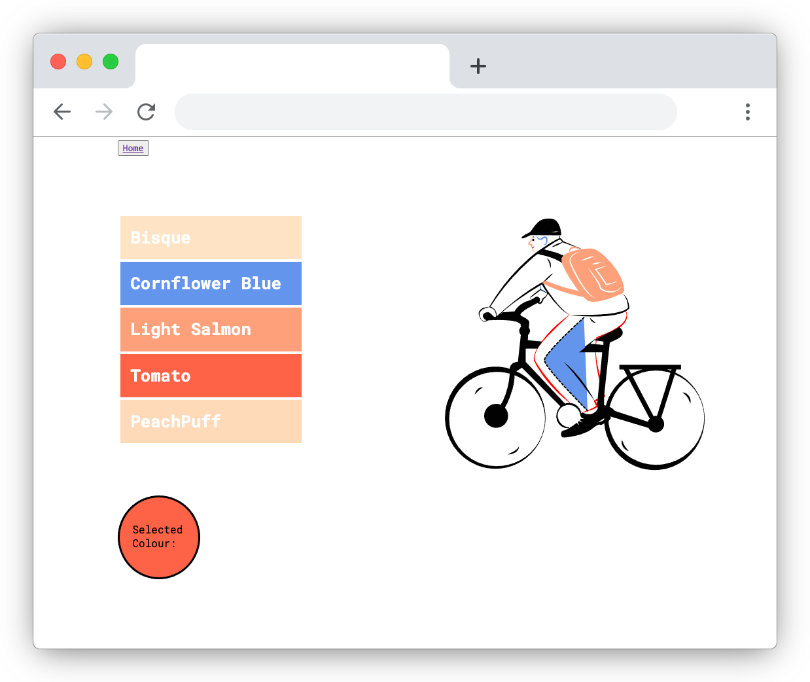

## CSS Colouring Book :pencil2:

### A simple, playfull web app :rainbow: Helping to deepen my knowledge around inline SVG images, animation, and CSS colour science
#### Tech Used: React, Vivus.js, In-line SVG

#### 

### - Very much a project under-construction
